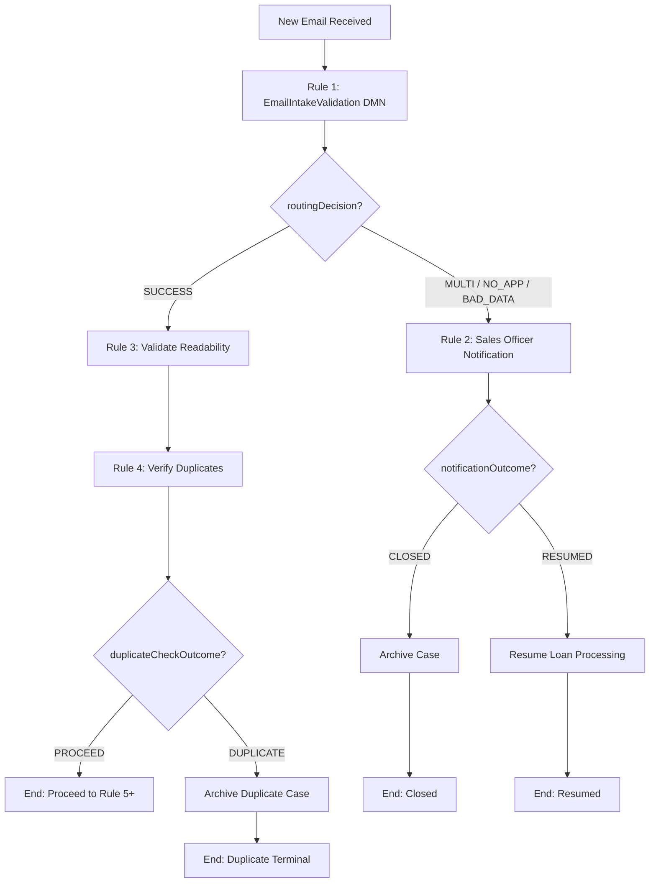

# Camunda 7 Community Edition – Docker Compose

A production-style Docker Compose setup for **Camunda 7 BPM Platform** (Community Edition, Tomcat distribution) backed by **PostgreSQL 15**.

## Architecture

| Service         | Image                                    | Port  | Profile  | Purpose                         |
| --------------- | ---------------------------------------- | ----- | -------- | ------------------------------- |
| **camunda**     | `camunda/camunda-bpm-platform:7.22.0`   | 8080  | default  | BPM engine, Cockpit, Tasklist   |
| **postgres**    | `postgres:15-alpine`                     | 5432  | default  | Process engine database         |
| **pgadmin**     | `dpage/pgadmin4:latest`                  | 5050  | tools    | Database administration UI      |
| **mock-worker** | `python:3.12-slim` (custom build)        | --    | dev      | Mock external task worker       |

## Project Structure

```
camunda-tryout/
├── resources/
│   ├── bpmn/               # Business Process Model & Notation files (.bpmn)
│   └── dmn/                # Decision Model & Notation rule files (.dmn)
├── mock-worker/
│   ├── Dockerfile
│   ├── requirements.txt
│   └── worker.py           # Mock external task worker
├── scripts/
│   └── deploy.sh           # Deploy resources to Camunda via REST API
├── tests/
│   └── dmn/                # DMN decision table test suites (shell scripts)
├── docker-compose.yml
├── .env.example            # Template – copy to .env before starting
├── .env                    # Local environment (git-ignored)
└── README.md
```

## Prerequisites

- [Docker](https://docs.docker.com/get-docker/) 20.10+
- [Docker Compose](https://docs.docker.com/compose/install/) v2+
- `curl` (used by deploy and test scripts)
- `python3` (used by deploy and test scripts for JSON parsing)

## Quick Start

```bash
# 1. Clone the repository
git clone https://github.com/<your-org>/camunda-tryout.git
cd camunda-tryout

# 2. Create your environment file from the template
cp .env.example .env

# 3. Set a strong database password in .env
#    (edit POSTGRES_PASSWORD – the default "changeme" is for demo only)

# 4. Start the core services (Camunda + PostgreSQL)
docker compose up -d

# 5. Wait for Camunda to finish booting (first run creates the DB schema)
docker compose logs -f camunda
```

Camunda will wait for PostgreSQL to become healthy before starting. First boot may take a minute while the database schema is created.

Once you see `org.apache.catalina.startup.Catalina.start Server startup` in the logs, Camunda is ready.

## Deploying Resources

Deploy all BPMN and DMN files from `resources/` to the running Camunda instance:

```bash
# Make the script executable (first time only)
chmod +x scripts/deploy.sh

# Deploy all resources in a single deployment (waits for Camunda to be ready)
./scripts/deploy.sh

# Deploy each resource as its own deployment
./scripts/deploy.sh --per-file

# Deploy to a different environment
CAMUNDA_REST_URL=http://other-host:8080/engine-rest ./scripts/deploy.sh
```

The script uses `deploy-changed-only=true`, so re-running it will skip resources that haven't changed since the last deployment.

| Variable           | Default                                 | Description                          |
| ------------------ | --------------------------------------- | ------------------------------------ |
| `CAMUNDA_REST_URL` | `http://localhost:8080/engine-rest`     | Camunda REST API base URL            |
| `DEPLOY_NAME`      | `camunda-tryout`                        | Deployment name shown in Cockpit     |
| `WAIT_TIMEOUT`     | `120`                                   | Seconds to wait for Camunda startup  |

## Access

| Application         | URL                                                      |
| ------------------- | -------------------------------------------------------- |
| Camunda Welcome     | http://localhost:8080/camunda-welcome/index.html         |
| Cockpit             | http://localhost:8080/camunda/app/cockpit/               |
| Tasklist            | http://localhost:8080/camunda/app/tasklist/              |
| Admin               | http://localhost:8080/camunda/app/admin/                 |
| REST API            | http://localhost:8080/engine-rest                        |

**Default credentials:** `demo` / `demo`

> **Security note:** The REST API does not require authentication by default. See the [Camunda security docs](https://docs.camunda.org/manual/latest/reference/rest/overview/authentication/) to enable it.

## Optional: pgAdmin

pgAdmin is placed behind a Docker Compose profile so it is **not started by default**.

```bash
# Start all services including pgAdmin
docker compose --profile tools up -d
```

Access pgAdmin at http://localhost:5050 and connect to:
- **Host:** `postgres`
- **Port:** `5432`
- **Username / Password:** values from your `.env` file

## Configuration

All configuration is driven by environment variables in `.env`. Key settings:

| Variable              | Default       | Description                              |
| --------------------- | ------------- | ---------------------------------------- |
| `POSTGRES_USER`       | `camunda`     | PostgreSQL username                      |
| `POSTGRES_PASSWORD`   | *(required)*  | PostgreSQL password                      |
| `POSTGRES_DB`         | `camunda`     | Database name                            |
| `CAMUNDA_VERSION`     | `7.22.0`      | Camunda BPM Platform Docker image tag    |
| `CAMUNDA_PORT`        | `8080`        | Host port for the Camunda web apps       |
| `DB_CONN_MAXACTIVE`   | `20`          | Max active DB connections                |
| `DB_CONN_MAXIDLE`     | `20`          | Max idle DB connections                  |
| `DB_CONN_MINIDLE`     | `5`           | Min idle DB connections                  |
| `JAVA_OPTS`           | `-Xms512m -Xmx1024m` | JVM heap settings               |
| `JMX_PROMETHEUS`      | `false`       | Enable Prometheus JMX exporter on :9404  |
| `TZ`                  | `UTC`         | Container timezone                       |

## Deployed Decisions and Processes

### EmailIntakeValidation (DMN)

**File:** `resources/dmn/EmailIntakeValidation.dmn`
**Decision key:** `Decision_0pz9531`

Validates incoming loan application emails. Routes based on application count and whether requirements are present.

| loanApplicationCount | requirementsPresent | routingDecision |
| --- | --- | --- |
| = 1 | true | `SUCCESS` |
| > 1 | *(any)* | `MULTI_APPLICATION` |
| = 0 | *(any)* | `INVALID_NO_APPLICATION` |
| *(any)* | *(any)* | `INVALID_BAD_DATA` (catch-all) |

### SalesOfficerNotificationAction (DMN)

**File:** `resources/dmn/SalesOfficerNotificationAction.dmn`
**Decision key:** `SalesOfficerNotificationAction`

Determines what notification action to take at each stage of the Sales Officer follow-up protocol. Called by the BPMN process at each stage.

**Inputs:** `triggerReason`, `notificationStage`, `isBusinessHours`, `responseReceived`
**Outputs:** `action`, `notificationType`

| Key rule | Condition | action | notificationType |
| --- | --- | --- | --- |
| Kill switch | responseReceived = true | `RESUME_PROCESSING` | `NONE` |
| Initial (BH) | stage = INITIAL, business hours | `SEND_NOW` | `INITIAL_ALERT` |
| Initial (off-hours) | stage = INITIAL, outside BH | `SCHEDULE_NEXT_WINDOW` | `INITIAL_ALERT` |
| FU1/FU2 | stage = FU1 or FU2 | `SEND_NOW` or `SCHEDULE_NEXT_WINDOW` | `FOLLOW_UP_1` or `FOLLOW_UP_2` |
| Deadline | stage = DEADLINE | `CLOSE_WORKFLOW` | `CLOSING_MESSAGE` |

### ValidateApplicationReadability (BPMN) -- Rule 3

**File:** `resources/bpmn/ValidateApplicationReadability.bpmn`
**Process key:** `ValidateApplicationReadability`

Validates whether loan application documents are machine-readable. If not, routes to COG (Central Operations Group) for manual encoding.

**Flow:**

```
Start
  │
  ▼
Assess Readability (ext: assessReadability)
  │
  ├─ isReadable = true ──► Extract Borrower Data (ext: extractBorrowerData) ──► Merge ──► Data Ready
  │
  └─ isReadable = false ──► Send COG Email (ext: sendCogEmail)
                              │
                              ▼
                        Wait for COG Form (msg: CogFormSubmitted)
                              │
                              ▼
                        Extract Data from COG Encoding (ext: extractBorrowerData) ──► Merge ──► Data Ready
```

**External task topics:**

| Topic | Purpose |
| --- | --- |
| `assessReadability` | AI/OCR document quality check. Returns `isReadable` (boolean) |
| `sendCogEmail` | Sends email to COG mailbox, CC Sales Officer + MA |
| `extractBorrowerData` | Extracts and normalizes borrower data from documents |

**Message events:**
- `CogFormSubmitted` -- intermediate catch event; triggered when COG team submits the encoded form via MS Forms integration

**Output:** `borrowerDataReady = true` (both paths converge to success)

---

### VerifyDuplicateApplications (BPMN) -- Rule 4

**File:** `resources/bpmn/VerifyDuplicateApplications.bpmn`
**Process key:** `VerifyDuplicateApplications`

Checks for duplicate applications in a 30-day window using 6 criteria (source, referee, collateral, primary borrower, co-borrower set).

**Flow:**

```
Start
  │
  ▼
Check Duplicate Applications (ext: checkDuplicateApplication)
  │
  ├─ isDuplicate = false ──► Set Outcome: PROCEED ──► End (Proceed to Rule 5+)
  │
  └─ isDuplicate = true ──► Notify Sales Officer (ext: notifyDuplicate) ──► Set Outcome: DUPLICATE ──► End (Terminal)
```

**External task topics:**

| Topic | Purpose |
| --- | --- |
| `checkDuplicateApplication` | Queries 30-day history, returns `isDuplicate` (boolean) |
| `notifyDuplicate` | Notifies Sales Officer about the duplicate |

**Output:** `duplicateCheckOutcome` = `PROCEED` or `DUPLICATE`

---

### AutoLoanEmailIntakeProcess (BPMN) -- Parent Orchestration

**File:** `resources/bpmn/AutoLoanEmailIntakeProcess.bpmn`
**Process key:** `AutoLoanEmailIntakeProcess`

The **top-level process** that chains all 4 rules together. Start this process when a new loan-application email arrives.

**Flow:**



**Routing decision branches:**

| routingDecision | Path |
| --- | --- |
| `SUCCESS` | Rule 3 (Call Activity) → Rule 4 (Call Activity) → Gateway |
| `MULTI_APPLICATION` | Exception → Rule 2 notification protocol |
| `INVALID_NO_APPLICATION` | Exception → Rule 2 notification protocol |
| `INVALID_BAD_DATA` | Exception → Rule 2 notification protocol |

**After Rule 4 completes**, the process checks `duplicateCheckOutcome`:
- `PROCEED` → End (placeholder for Rule 5+)
- `DUPLICATE` → External task `archiveCase` → Terminal end

**After Rule 2 completes**, the process checks `notificationOutcome`:
- `RESUMED` → External task `resumeLoanProcessing`
- `CLOSED` → External task `archiveCase`

---

### SalesOfficerNotificationProcess (BPMN) -- Child Process

**File:** `resources/bpmn/SalesOfficerNotificationProcess.bpmn`
**Process key:** `SalesOfficerNotificationProcess`

Called by `AutoLoanEmailIntakeProcess` as a **Call Activity** when Rule 1 returns a non-SUCCESS outcome. Receives `triggerReason` from the parent.

Orchestrates the Sales Officer notification and follow-up workflow:

1. Calculates business hours (weekdays 6:00 AM - 10:00 PM) and calls the notification DMN
2. Sends initial notification (immediately or at next business window)
3. Waits 1 hour, sends Follow-Up 1
4. Waits 3 hours, sends Follow-Up 2
5. Calculates 16 business-hour deadline, sends closing message if reached

An **interrupting message boundary event** (`SalesOfficerResponse`) acts as a kill switch -- if the Sales Officer responds at any point, all pending follow-ups are cancelled and loan processing resumes.

**Output variables** (propagated back to parent):
- `notificationOutcome` = `RESUMED` (Sales Officer responded) or `CLOSED` (deadline reached with no response)

**External task topics** (require worker implementation):
- `sendNotification` -- sends INITIAL_ALERT, FOLLOW_UP_1, FOLLOW_UP_2, or CLOSING_MESSAGE
- `resumeLoanProcessing` -- resumes the main loan workflow after Sales Officer response

### Mock External Task Worker

**File:** `mock-worker/worker.py`
**Docker profile:** `dev`

A Python-based mock worker that polls all external task topics and completes them with configurable responses. Run with the `dev` profile:

```bash
docker compose --profile dev up -d
```

**Handled topics:** `sendNotification`, `resumeLoanProcessing`, `routeToNextStage`, `archiveCase`, `assessReadability`, `checkDuplicateApplication`, `sendCogEmail`, `extractBorrowerData`, `notifyDuplicate`

**Configuration (environment variables):**

| Variable | Default | Description |
| --- | --- | --- |
| `MOCK_IS_READABLE` | `true` | Controls `assessReadability` result |
| `MOCK_IS_DUPLICATE` | `false` | Controls `checkDuplicateApplication` result |
| `MOCK_AUTO_COG_RESPONSE` | `true` | Auto-send `CogFormSubmitted` message after COG email |
| `MOCK_COG_DELAY` | `3` | Seconds to wait before auto-sending COG form message |

## Running Tests

```bash
# Make test scripts executable (first time only)
chmod +x tests/dmn/*.sh

# Run all DMN test suites
./tests/dmn/EmailIntakeValidation_test.sh
./tests/dmn/SalesOfficerNotificationAction_test.sh

# Point at a different environment
CAMUNDA_REST_URL=http://other-host:8080/engine-rest ./tests/dmn/SalesOfficerNotificationAction_test.sh
```

## Monitoring (Prometheus JMX)

To expose JMX metrics in Prometheus format:

1. Set `JMX_PROMETHEUS=true` in `.env`.
2. Restart Camunda: `docker compose up -d camunda`.
3. Scrape metrics at `http://localhost:9404/metrics`.

You can mount a custom exporter config to `/camunda/javaagent/prometheus-jmx.yml`.

## Data Persistence

PostgreSQL data is stored in a named Docker volume (`postgres_data`).

```bash
# Stop services but keep data
docker compose down

# Stop services AND delete all data (destructive!)
docker compose down -v
```

## Upgrading Camunda

1. Update `CAMUNDA_VERSION` in `.env` to the desired version.
2. Review the [Camunda migration guide](https://docs.camunda.org/manual/latest/update/) for that version.
3. Re-create the container:

```bash
docker compose up -d camunda
```

## Troubleshooting

| Symptom | Fix |
| --- | --- |
| `POSTGRES_PASSWORD must be set` | You forgot to create `.env`. Run `cp .env.example .env` |
| Camunda exits immediately | Check logs: `docker compose logs camunda`. Usually a DB connectivity issue — wait for postgres healthcheck |
| `permission denied: ./scripts/deploy.sh` | Run `chmod +x scripts/deploy.sh` |
| Deploy script says "Camunda did not become ready" | Increase `WAIT_TIMEOUT` or ensure Camunda is running: `docker compose ps` |
| Port conflict on 8080 or 5432 | Change `CAMUNDA_PORT` or `POSTGRES_PORT` in `.env` |

## Production Considerations

This Docker Compose setup is designed for **development and demonstration**. For production deployments, consider:

- **Orchestration:** Kubernetes with [Helm charts](https://docs.camunda.org/manual/latest/installation/docker/)
- **Database:** Managed PostgreSQL (e.g., AWS RDS, Azure Database, GCP Cloud SQL)
- **Secrets management:** HashiCorp Vault, Kubernetes Secrets, or cloud-native secret managers
- **Networking:** Reverse proxy / load balancer (Nginx, Traefik) with TLS
- **Monitoring:** Prometheus + Grafana stack scraping the JMX exporter endpoint
- **Backups:** Automated PostgreSQL backups (pg_dump, WAL archiving)

## License

Camunda 7 Community Edition is licensed under the [Apache License 2.0](https://www.apache.org/licenses/LICENSE-2.0).
